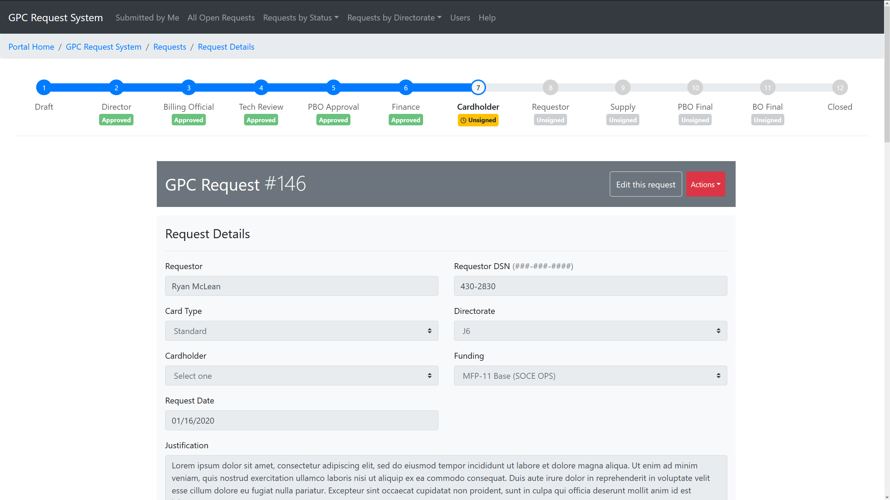

# GPC Request System

React application for tracking GPC purchase requests in Sharepoint. This project was bootstrapped with [Create React App](https://github.com/facebook/create-react-app).  

 

## Run this app

1. `git clone https://github.com/mcleanra/purchaseCard`
2. `cd purchaseCard`
3. `yarn`
4. `yarn proxy` (and enter credentials for soceur.sharepoint.com)
5. CTRL+C to exit once the proxy starts
6. `npm run dev`

## Available Scripts

In the project directory, you can run:

### `yarn proxy`

Starts the sp-rest-proxy. Run this first so you can set up your credentials - point it to `https://soceur.sharepoint.com/gpc`

### `yarn dev`

Start the proxy and open the app in development mode. 

Open [http://localhost:3000](http://localhost:3000) to view it in the browser.

The page will reload if you make edits. 
You will also see any lint errors in the console.

### `yarn test`

Launches the test runner in the interactive watch mode. 
See the section about [running tests](https://facebook.github.io/create-react-app/docs/running-tests) for more information.

### `yarn build`

Builds the app for production to the `build` folder. 
It correctly bundles React in production mode and optimizes the build for the best performance.

The build is minified and the filenames include the hashes. 
Your app is ready to be deployed!

## Deployment

- Copy all files from /build to a site in SharePoint at `/app/gpc`
- Create the ccRequestTracker and ccUsers lists to mirror what is in SPO.
- Copy all files from /src/legacy to the `/app/gpc` site. This app uses the `cc_user_*.aspx` pages.

If Sharepoint complains, you can skip copying the `.json` files that are in /build.
